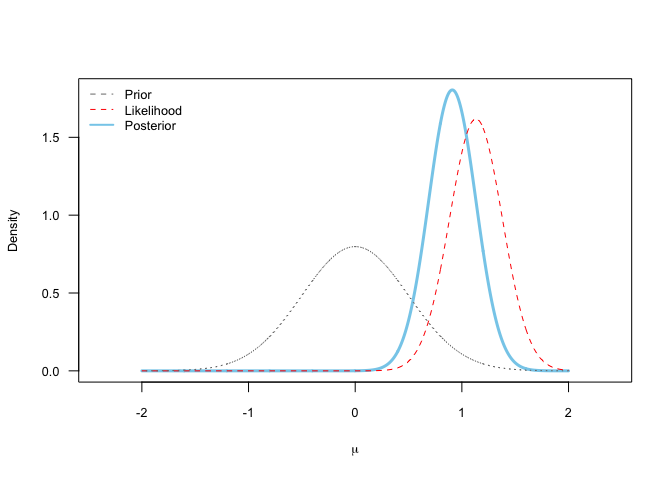

The `plotBayes` package illustrates Bayesian inference, showing how the
prior distribution and the likelihood of the data combine to produce a
posterior distribution.

This is mostly a toy package useful for teaching.

Installation
============

You need the `devtools` package to install this from github.

``` r
install.packages("devtools")
```

Then install `plotBayes`.

``` r
devtools::install_github("mcbeem/plotBayes")
```

And then load it.

``` r
library(plotBayes)
```

Example
=======

Normal prior with *μ* = 0, *σ* = 0.5:

``` r
set.seed(1)
data <- rnorm(n=10, mean=1, sd=1)
plotBayes(data, prior.type="normal", prior.parameters=c(0, .5), min=-2, max=2)
```


    ## $data.mean
    ## [1] 1.132203
    ## 
    ## $map
    ## [1] 0.9109109
    ## 
    ## $eap
    ## [1] 0.9103311
    ## 
    ## $credible.interval
    ## [1] 0.4744745 1.3433433

You can request a different credible interval with with argument
`credible=`.

``` r
plotBayes(data, prior.parameters=c(.0, .5), prior.type="normal",
          min=-2, max=2, credible=.68)
```



    ## $data.mean
    ## [1] 1.132203
    ## 
    ## $map
    ## [1] 0.9109109
    ## 
    ## $eap
    ## [1] 0.9103311
    ## 
    ## $credible.interval
    ## [1] 0.6866867 1.1271271

Uniform prior with *a* = .7, *b* = 1.5:

``` r
plotBayes(data, prior.type="uniform", prior.parameters=c(.7, 1.5), min=-2, max=2)
```


    ## $data.mean
    ## [1] 1.132203
    ## 
    ## $map
    ## [1] 1.131131
    ## 
    ## $eap
    ## [1] 1.120113
    ## 
    ## $credible.interval
    ## [1] -1.951952 -1.239239
